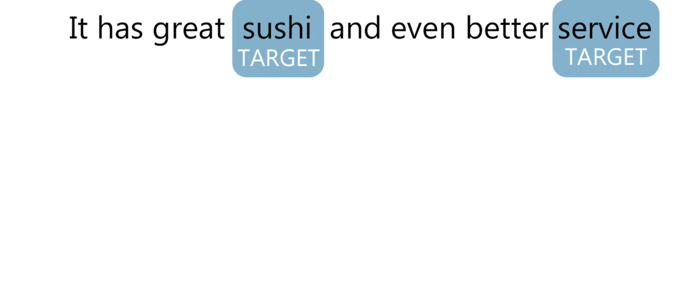
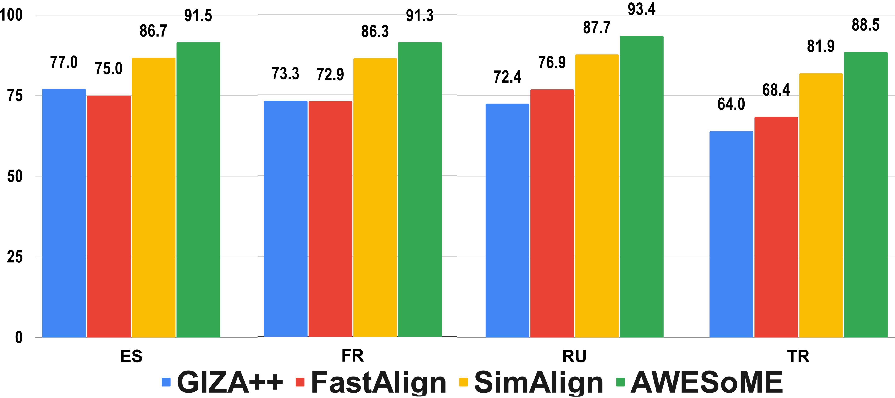

<p align="center">
    <br>
    
    <br>
<br>
<a href="https://twitter.com/intent/tweet?text=Wow:&url=https%3A%2F%2Fgithub.com%2Fikergarcia1996%2FCross-lingual-Annotation-Projection"></a>
<a href="https://github.com/ikergarcia1996/Cross-lingual-Annotation-Projection/blob/main/LICENSE.md"></a>
<a href="https://ikergarcia1996.github.io/Iker-Garcia-Ferrero/"></a>
<br>
</p>

>Looking for our manually/automatically projected ABSA/CoNLL datasets? See [data/](data/)


This repository contains the code to easily project labels from one dataset into another. You can automatically generate 
datasets for languages for which you do not have any labelled data 🥳  
We currently support:
- [mGiza (giza++)](http://www2.statmt.org/moses/giza/GIZA++.html)
- [Fast Align](https://aclanthology.org/N13-1073.pdf)
- [SimAlign](https://arxiv.org/abs/2004.08728)
- [AWESOME](https://arxiv.org/abs/2101.08231)




>For translating your dataset check out  [Easy-Translate](https://github.com/ikergarcia1996/Easy-Translate)!!!

## Performance of projection methods


## Citation
If you use this software please cite
````
@inproceedings{garcia-ferrero-etal-2022-model,
    title = "Model and Data Transfer for Cross-Lingual Sequence Labelling in Zero-Resource Settings",
    author = "Garc{\'\i}a-Ferrero, Iker  and
      Agerri, Rodrigo  and
      Rigau, German",
    booktitle = "Findings of the Association for Computational Linguistics: EMNLP 2022",
    month = dec,
    year = "2022",
    address = "Abu Dhabi, United Arab Emirates",
    publisher = "Association for Computational Linguistics",
    url = "https://aclanthology.org/2022.findings-emnlp.478",
    pages = "6403--6416",
}
````
Remember that you must also cite the corresponding paper for the word-alignment generation method you use. 

## Installation
This code requires: 
````
Python 3.6 or higher
PyTorch
tqdm
````
You will need to install each of the alignment tools separately. You will find
a README.md file in each of the folders with the instructions to install them.
You don't need to install all of them, just the ones you want to use. I recommend
using SimAlign or AWESOME. SimAlign is much faster than AWESOME, it doesn't require training. 
AWESOME requires finetuning (can take many hours) and a GPU with >8Gb VRAM , but it is more accurate.

If you use our software, please cite [our paper](https://arxiv.org/abs/2210.12623) and the alignments methods you use :blush:

## How-To 
This is a sample projection run to test the system.
````commandline
python3 annotation_projection.py \
--source_test sample/en.absa.test.tsv \
--target_test sample/en2es.absa.test.txt \
--source_augmentation sample/en.txt \
--target_augmentation sample/es.txt \
--output_dir sample/output/ \
--output_name en2es_absa_test \
--do_simalign 
````

### Source datasets:
Source datasets in TSV format (see [sample/en.absa.test.tsv](sample/en.absa.test.tsv) for an example).
Our code supports IOB/IOB2/BILOU encoding, but we have tested it mainly with IOB2, so we recommend using it.
The three splits are optional, but you must provide at least one. 
We will not perform any validation in the dev set or evaluation in the test set. 
This is just a convenience for projecting datasets that have multiple splits (we automatically concatenate/split them).
````commandline
--source_train /path/to/source_train.tsv
--source_dev /path/to/source_dev.tsv
--source_test /path/to/source_test.tsv
````

### Target datasets:
Target sentences in txt format, one per line (see  [sample/en2es.absa.test.txt](sample/en2es.absa.test.txt) for an example).
The splits should be parallel (translations) to the corresponding one in the source split and in the same order. 
The splits should contain the same number of sentences that the corresponding source split. 
The splits are optional, but if you provide a source dataset, you must provide a corresponding target dataset.
````commandline
--target_train /path/to/target_train.txt
--target_dev /path/to/target_dev.txt
--target_test /path/to/target_test.txt
````

### Output directory:
The output directory is where the alignments (talp file) and projections (tsv file) will be saved.
The name of the files that will be created. 
The output files will have the path: `{output_dir}/{output_name}.{alignment_method}.{data_split}.[talp|tsv]`
````commandline
--output_dir /path/to/output/
--output_name en2es_absa
````

### Alignment method:
The alignment methods to use. The alignment method should be correctly installed/compiled to be used. 
See the README.md file inside each alignment method directory for more info about installation. 
You don't need to install all of them, just the ones you want to use.
If the flag is provided, we will generate the alignments and projections for the corresponding alignment method.
You can provide multiple alignment methods, at least one of them must be provided.
If you want to modify the parameters of the alignment method, you should modify the
"model_utils.py" file inside each alignment method directory.
````commandline
--do_mgiza
--do_fastalign
--do_simalign
--do_awesome
````
If you use AWESoME you can provide two additional flags. "remove_awesome_model" will delete the pretrained 
AWESoME model from the output directory after the alignments are generated. You can also provide the "awesome_model_path"
flag to specify the path to a pretrained AWESoME model, we will use this model instead of training a new one.
````commandline
--remove_awesome_model
--awesome_model_path /path/to/awesome_model_dir
````

### Data Augmentation:
Your dataset may be too small to be used for training the alignment method. You can 
provide an extra parallel corpus as data augmentation for training the alignment method. We will
use both, the provided tain/dev/test splits together with the augmented corpus to train the alignments.
The augmentation corpus consists of two txt files (a sentence per line), and the source data augmentation dataset
should be in the same language of the source dataset. The target data augmentation dataset should be in the same
language of the target dataset. Both datasets should have the same number of sentences. See [sample/en.txt](sample/en.txt) and 
[sample/es.txt](sample/es.txt) for an example.

````commandline
--source_augmentation /path/to/source_augmentation.txt
--target_augmentation /path/to/target_augmentation.txt
````

### Hyperparameters:
There are two hyperparameters that you can modify to tune the projection algorithm to your dataset.

***Punctuation***: By default we remove punctuation from the alignments to prevent projecting a word into a punctuation mark. 
We do this because in the NER and ABSA datasets a punctuation is never annotated, but this may not be the case for other datasets.
If you want to allow labels in the source sentence to be projected into punctuation marks, set the `--do_not_remove_puncs` flag. 
For example, If `coffee` is projected into `café .` we will remove the `.` from the alignment. 
But we will not remove the `.` if the flag `--do_not_remove_puncs` is set.

***Gaps in the alignments***: If a label in the source sentence is split in two or more parts in the target sentence, we will
fill the gap considering the unlabelled words between the parts as labelled words with the same class if the gap
is equal or lower than "--fill_gap_size" words (by default 1). For example, if we project a label and we get the following labels:  
`O B-LOC I-LOC O I-LOC O O` we will fill the gap and get `O B-LOC I-LOC I-LOC I-LOC O O`. 
Use 1 if you are projecting named entities or labels with a small number of words. 
Use a larger value for argumentation datasets and datasets in which long sentences are labeled. 

````commandline
--fill_gap_size 1 \
--do_not_remove_puncs
````

If you want to test different hyperparameters without computing the alignments again, you can use the 
`--use_existing_alignments` flag. You must use the same `--output_dir` and `--output_name` as the previous run and the same 
train, dev and test files.

## Generate word alignments
If you only want to generate word alignments, you can use the "generate_alignments.py" script.
This script has the same parameters as the "annotation_projection.py" script, but the source and target datasets
should be in txt format (one sentence per line). The output will be a ".talp" file with the alignments.

````commandline
python3 generate_alignments.py \
--source_test sample/en.txt \
--target_test sample/es.txt \
--output_dir sample/output/ \
--output_name en2es_absa_test \
--do_simalign 
````
